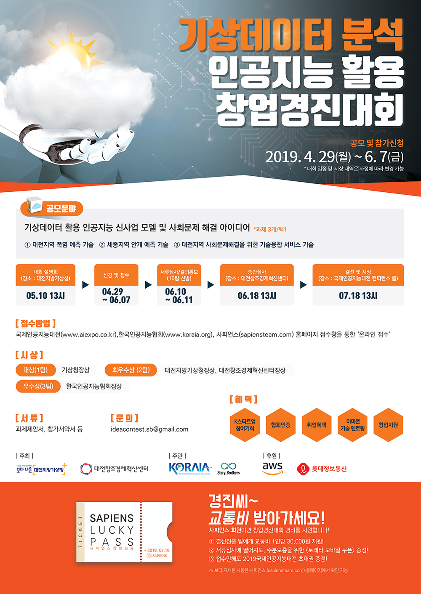
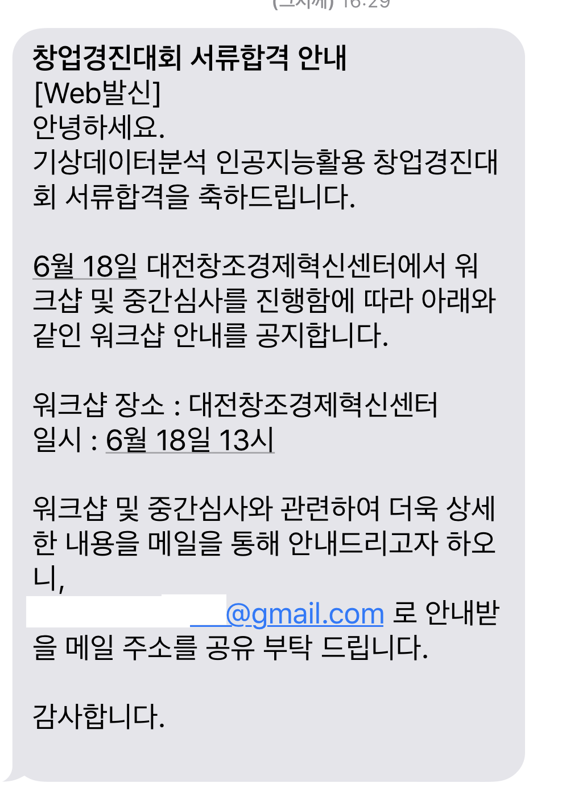
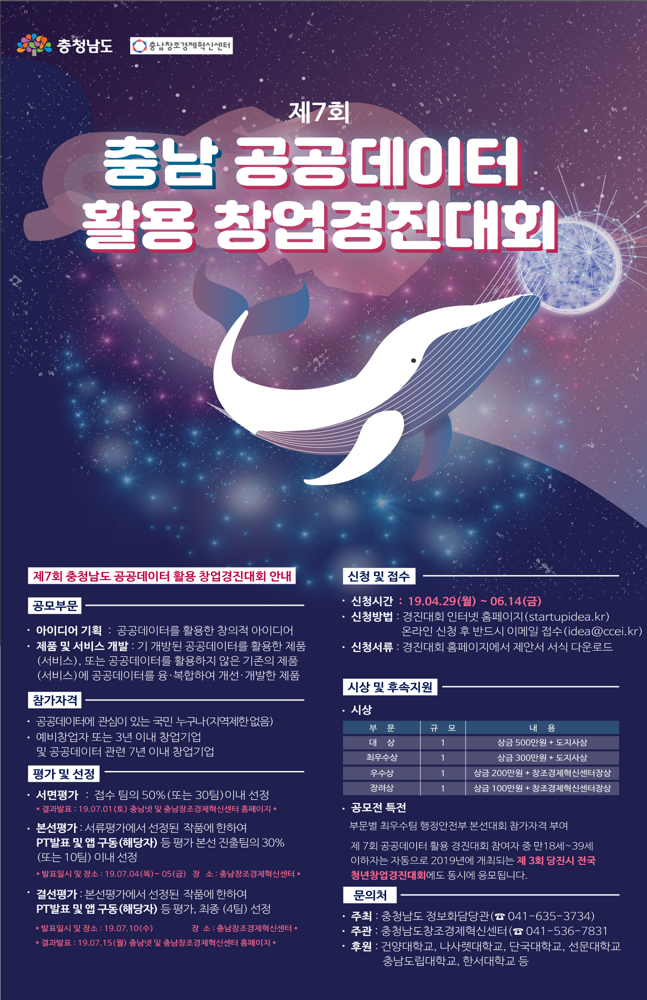

# 경진대회 참여 목록
## 경진대회
### 기상데이터분석 인공지능활용 창업경진대회
[바로가기](https://sapiensteam.com/bbs/event/bbsDetail.do?bbsSn=50)

1. 일정 
    - 신청 접수 : 4월29일 ~ 6월7일
    - 서류 심사 : 6월10일 ~ 6월11일
    - 중간 심사 : 6월 18일 13시 대전 창조경제혁신센터
    - 결선 및 시상 : 7월 18일 13시 coex 국제인공지능대전 컨퍼런스

    본선 합격 문자

   

---
### 충남공공데이터 활용 창업경진대회
[바로가기](http://www.chungnam.go.kr/cnnet/board.do?mnu_url=/cnbbs/view.do?board_seq=242918&code=36&mnu_cd=CNNMENU00148)
